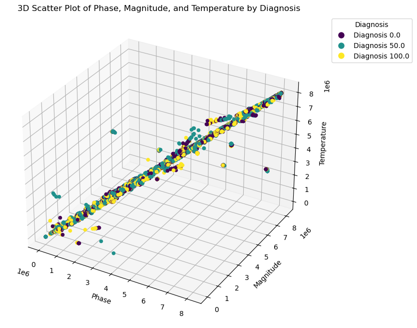
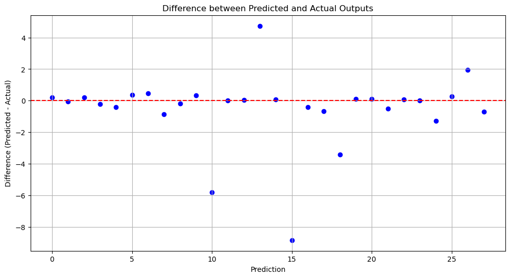
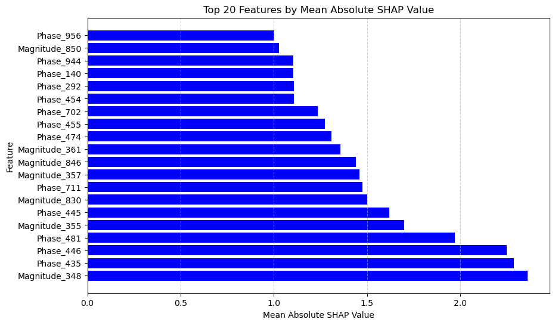
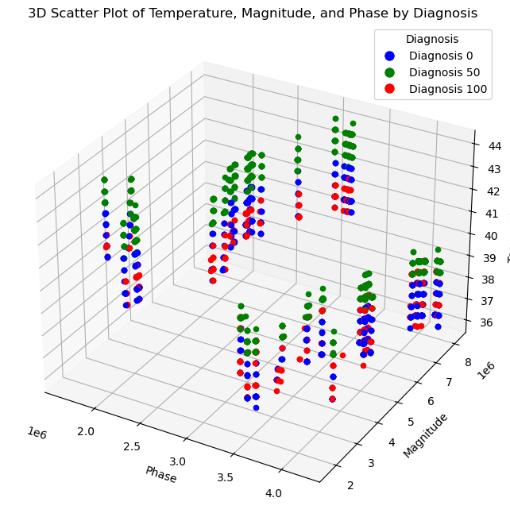
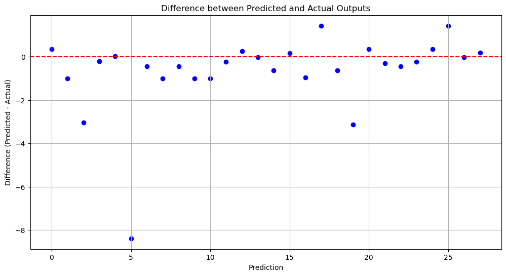

# Cubescan with temperature

Cubescan is a novel deviced make by Radiolife. Cubescan leverages RF technology and AI to advance pathologies research, revolutionizing disease understanding and patient care.

Bellow is part of my contribution to this project. See the src folder for the code. The data was listed on the .gitignore. 

After experimenting with a few different models we decided on the Gradient Boosting Regressor. This is inline with previous models built for classification that used random forests and decision trees when classifying Cubescan data. Previous testing preformed looked at classifying test tubes which either contained saline or water. For this test, we aimed to determine the percent concentration. We employed a Gradient Boosting Regressor, a machine learning algorithm known for its robustness and effectiveness in handling various types of data. We used a grid search to identify the optimal parameters and hyperparameters for our predictive model. Gradient Boosting works by building an ensemble of weak prediction models, typically decision trees, to form a strong predictive model.

A test tube is placed in the Cubescan and a series of radio frequency signals are emited. The data consists of magnitude and phase readings for 1000 frequencies along with tempature readings for every sample tested, along with the target attribute and device serial number. 

As part of our data preparation process, we performed a series of transformations on the dataset to facilitate subsequent analysis. The dataset, originally in CSV format, contains a wide range of measurements categorized into magnitude, phase, and temperature readings, alongside diagnostic categories. We began by importing the dataset using Pandas, a powerful data manipulation library in Python. The dataset from Cubescan, was loaded into a DataFrame in Python. DataFrames are tabular data structures with labeled axes, which Pandas utilizes for data manipulation tasks. After some minor cleaning and preprocessing steps to standardize the dataset, enabling a more streamlined and effective analysis in the subsequent stages of our study.

Using a parameter grid search with our scaled training data, the best hyperparameters were identified as a learning rate of 0.08, a max depth of 2, a 'sqrt' method for max features, a min samples leaf of 4, min samples split of 2, and 210 estimators.

This model had
**Mean Squared Error:** 5.5230984030978405

**R-squared:** 0.997169863301942

**Mean Squared Error (MSE):**
Measures the average of the squares of the errors, i.e., the average squared difference between the estimated values and the actual value. A lower MSE value indicates a better fit.
R-squared (R²): Provides a measure of how well the observed outcomes are replicated by the model, based on the proportion of total variation of outcomes explained by the model. An R² closer to 1 indicates a better fit.

We used cross validation scores to determine how the model was doing, making sure to avoid a model that might be overfitting. When interpreting the scores from cross-validation, it's important to remember that in the context of scikit-learn, a negative value for the mean squared error (MSE) is used due to the way the library handles optimization problems—it tries to maximize a function. Since MSE is a value that is minimized, the library reports it as negative. To interpret these scores, we take the absolute value.

**Training Scores Interpretation:**
The training scores are very close to zero, which is excellent for a mean squared error metric, where lower values are better and zero represents a perfect fit. However, these very low negative MSE values suggest that the model fits the training data very well, perhaps too well. In practice, such low values could raise concerns about overfitting, where the model learns the training data so closely that it may not generalize well to unseen data.

**Test Scores Interpretation:**
The test scores, on the other hand, vary widely and are substantially higher (more negative) than the training scores. The absolute values of these test scores are quite large compared to the training scores, indicating a significant drop in performance when the model is applied to unseen data. This discrepancy suggests that the model may not be generalizing well, which is often a sign of overfitting.

The large variance in test scores, as evidenced by the range from around -2 to -53, also indicates inconsistency in the model's predictive ability. Some folds result in relatively small errors (e.g., -2.04677546), while others are much larger (e.g., -53.30179449), suggesting that the model's performance is highly dependent on the particular subset of data it's trained on.

In summary, the interpretation of these scores would lead to the conclusion that while the model appears to perform exceptionally well on the training data, this performance does not translate to the test data. This can often be mitigated by simplifying the model to improve generalization, collecting more training data, or applying regularization techniques. It is also critical to examine the data preprocessing steps, feature selection, and the possibility of data leakage, which could all contribute to overfitting.

When tested on the actual test set, the model did seem to perform a bit better than the scores from the cross validation suggested. 

**Reducing the dimensionality of the data for multiple reasons:**
In our study, we implemented dimensionality reduction as a crucial step in our data processing pipeline. This decision was driven by multiple factors, primarily focusing on enhancing model performance and addressing concerns of overfitting.

**Enhancing Model Performance on Devices:**
Our dataset contained a high number of features, which, while rich in information, posed challenges for computational efficiency. High-dimensional data can significantly increase the computational load, leading to slower processing times and increased memory usage. This is particularly critical when deploying models on devices with limited computational resources. The goal is to have these devices return results to the user very quickly. By reducing the dimensionality, we aim to streamline the data, ensuring that our model could operate efficiently on the intended device without compromising its predictive accuracy.

**Mitigating Overfitting:**
This also helped with overfitting. This is a common challenge in machine learning, where a model learns the training data too well, including its noise and outliers, at the expense of its ability to generalize to new, unseen data. This issue is often exacerbated in high-dimensional datasets where the number of features can greatly exceed the number of observations (a scenario known as the "curse of dimensionality"). By reducing the number of features, we aimed to simplify the model, making it less prone to capturing noise and more focused on learning the underlying patterns in the data. This simplification is expected to enhance the model’s ability to generalize, thereby improving its performance on unseen data.

**Feature Importance Analysis with SHAP:**

SHAP values provide an understanding of how each feature contributes to the prediction, which is crucial for interpretability, especially in complex models like Gradient Boosting.
SHAP values are based on game theory and offer a consistent and accurate method to quantify the impact of each feature.
The mean absolute SHAP values were calculated for each feature, providing insight into which features are most important in the model's predictions. This is particularly useful for feature selection, understanding model behavior, and communicating results in a more interpretable manner.

**Top Features Analysis:**
The top 20 features, based on the mean absolute SHAP values, were identified. This approach helps in pinpointing the features that have the most significant impact on the model's predictions.
By focusing on these top features, we can gain insights into the driving factors behind the model's predictions and potentially identify areas for further investigation or data collection.

**Rationale:**
Using Gradient Boosting combined with SHAP for feature importance analysis makes sense for a robust predictive model that not only aims for high accuracy but also provides clarity on how different features influence the outcome. This dual approach ensures that the model is not just a 'black box' but a tool for gaining deeper insights into the underlying data patterns.

Then data engineer was used to rebuild a dataset from the original dataset which included the selected columns from SHAP. Because all numbers have three counter parts, we need to ensure that all are brought in because that will be the actual data we will receive from the device. 

To visualize the relationship between temperature, magnitude, and phase across different diagnostic categories within our dataset, we generated a three-dimensional scatter plot. This dataset comprised multiple measurements of temperature, magnitude, and phase, each associated with a specific diagnostic value. The following steps were taken to prepare the data and create the visualization:

At this point, we needed to retrain the model for the smaller dataset as this will be the dataset pull from the machine. We ran a hyperparameter grid search again and then fitted the model.

We again used cross validation to check on how the model was generalizing. Again we find that there is a good chance the model is overfitting. 

The difference between the mean training score and the mean test score, along with the high standard deviation in the test scores, suggests that the model may be overfitting. Overfitting occurs when a model learns the training data too well, including its noise and details, at the expense of its ability to generalize to new, unseen data.

To address this it would make sure to reach a sufficient level of diversity of training data. At this point we really do not have enough data. This will help improve generalizability.

When we tested the model on the test set we saw what appears to be good results.

**Mean Squared Error:** 4.370561661570223

**R-squared:** 0.9977604442204764
 

Overall the client, Radiolife, was happy with these results. 